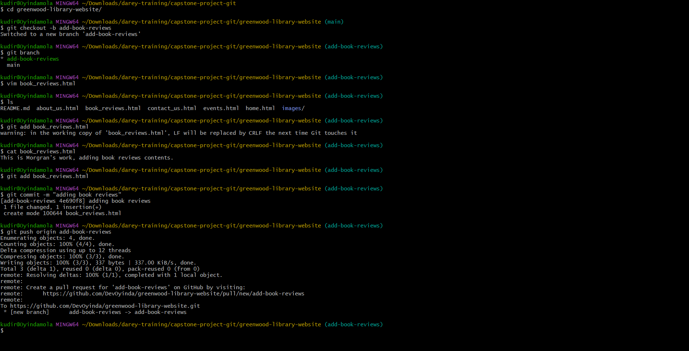
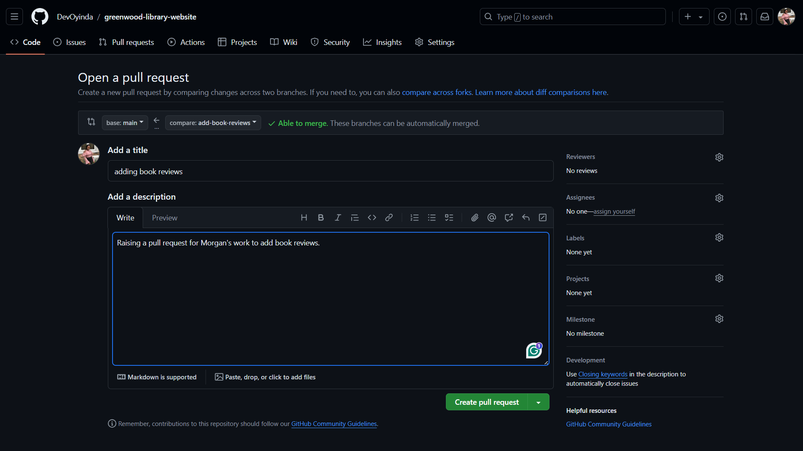
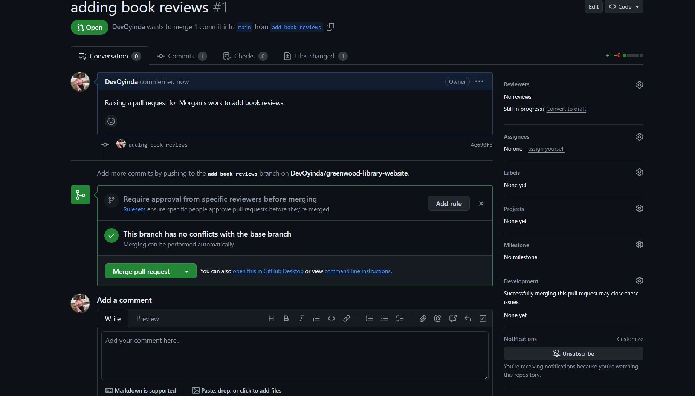
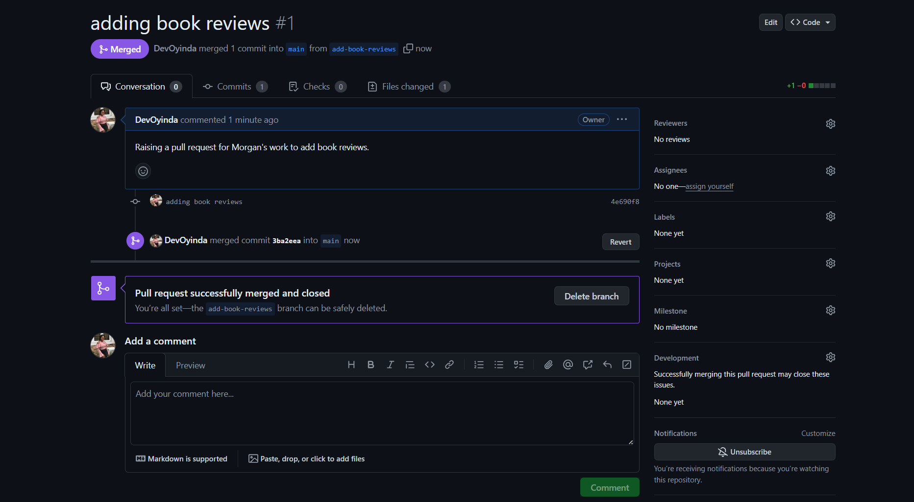
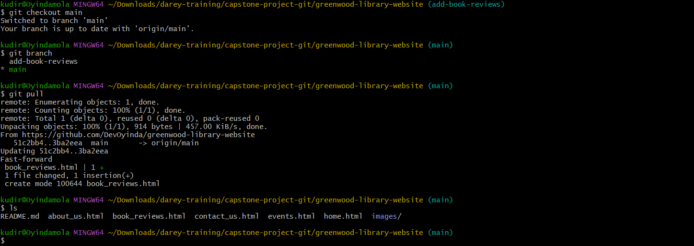
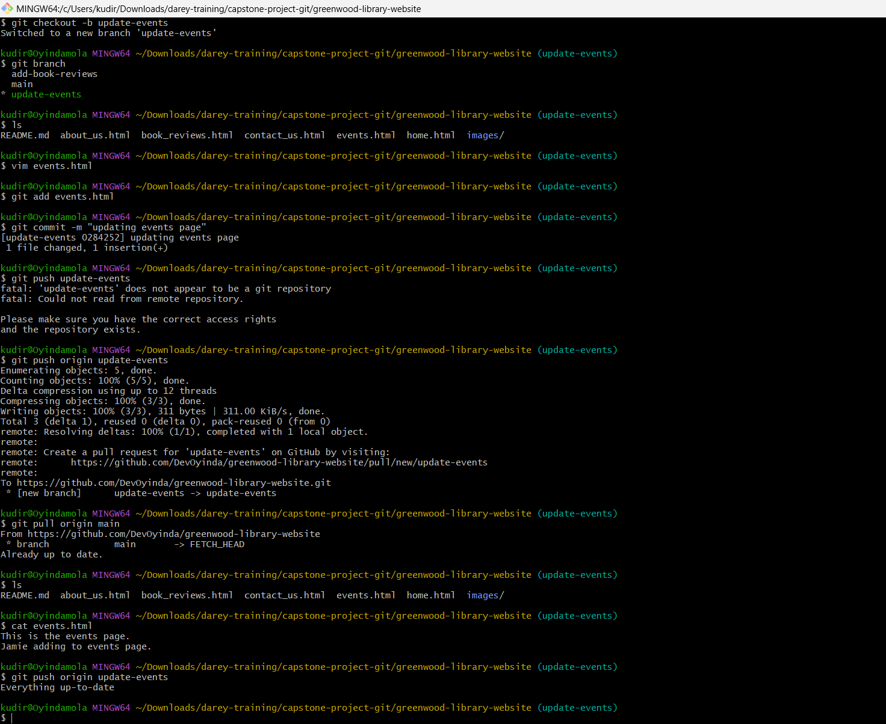
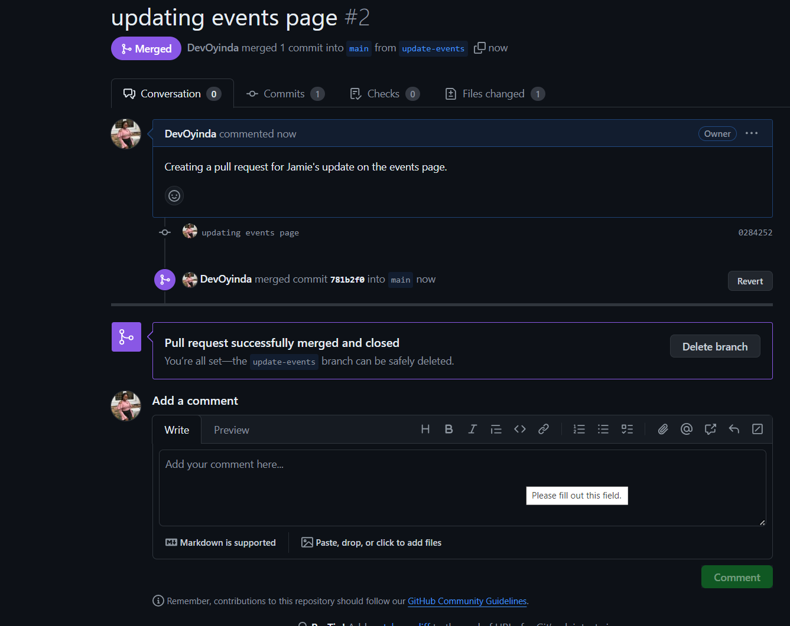

# greenwood-library-website
This is the repository for my Capstone Project on Git.

# PROJECT 1: Greenwood Library Website

This is my first capstone project from the Darey.io bootcamp. The project involves enhancing a community library website. 
It involves practicing cloning a repository and working with branches in Git. Gaining experience with staging, commiting and pushing changes from 2 contributors, creating pull requests and merging them.

## Step by step process on how this project was done.

### 1. Creating the Project Folder
Firstly, I created a folder to store all my projects using Git Bash.

```bash
mkdir capstone-project-git
cd capstone-project-git 
```


### 2. Setting up the GitHub Repositiry
I logged into my github account and created a new repository named `greenwood-library-website`.


### 3. Cloning the Repository 
Next, I cloned the newly created repository into my `capstone-project-git` folder.

* Copied the repo url from github.


* Used the `git clone` command to clone the repository.
```bash
git clone https://github.com/DevOyinda/greenwood-library-website.git
```

* Opened the cloned repo in Visual Studio Code.
```bash 
cd greenwood-library-website
code .
```


### 4. Creating HTML Files on VSCode
In VSCode, I craeted four new html files. `home.html`, `events.html`, `contact_us.html` and `about_us.html`. I then added contents to each file.


### 5. Adding book reviews (Morgan's Work)
* Creating a Branch for Morgan
switch to a new branch named `add-book-reviews`
* add book reviews section
creating a new file `book_reviews.html` to represent book review section
added content into the file.
* stage, commit and push changes to gitub.
```bash
git checkout -b add-book-reviews
vim book_reviews.html
git add book_reviews.html
git commit -m "Add book reviews section"
git push origin add-book-reviews
```



* Raise a pull request
Pushing the `add-book-reviews` branch to Githib and raise a PR for Morgans's work.


Merging Morgan's work to main branch



* Moved to main branch and pull merged changes into main branch.
```bash
git checkout main
git pull
```



### 6. Updating Events Page (Jamie's Work)
* Create a branch for Jamie
* update events page.
* stage, commit, and push changes.
```bash
git checkout -b update-events
git add events.html
vim events.html
git add events.html
git commit -m "Update events page"
git push origin update-events
```


* Raise a pull request 
Pull latest changes from `main` branch to `update-events` before raising PR.
```bash 
git pull origin main
```
Raise a PR for Jamie's work and merge to `main` branch.



* Final stage, checkout to `main` branch and pull all changes.
```bash
git checkout main
git pull
```


