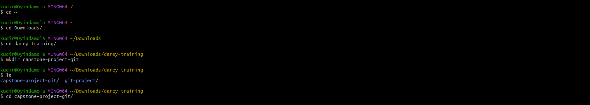
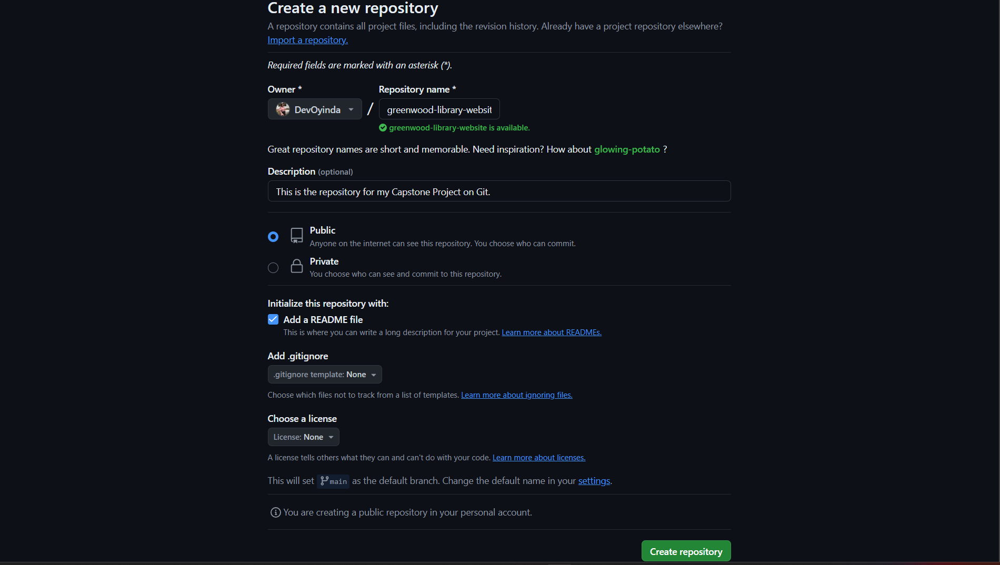
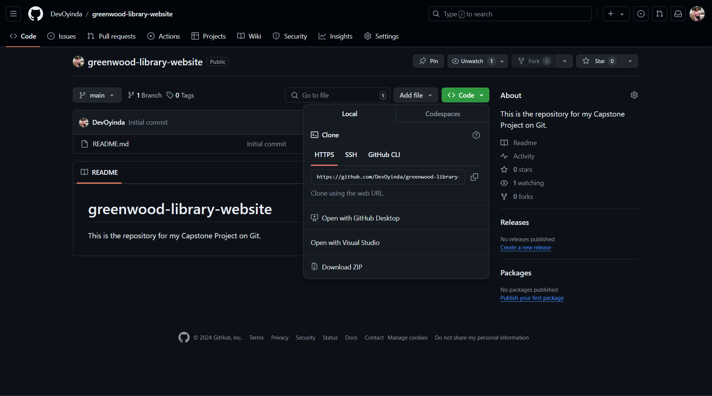
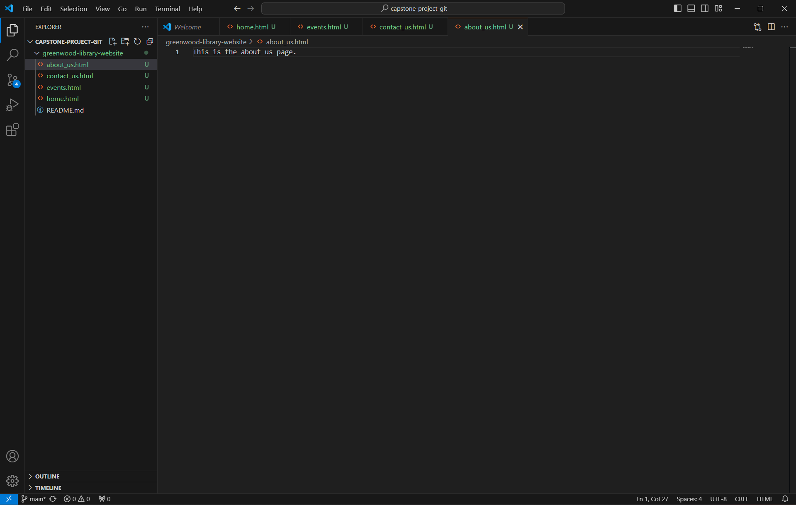

# greenwood-library-website
This is the repository for my Capstone Project on Git.

## PROJECT 1
This is my first capstone project on Darey.io bootcamp. 

### Step by step process on how this project was done.

1. I opened git bash and created a folder in my darey-training folder to store all my projects.

Using the commande mkdir capstone-project-git. I entered into the folder with the cd command. 

2. Logged into my github account and created a new repository called greenwood-library-website.

3. Opened git bash, copied and cloned the newly created repository in my capstone-project-git folder.
Copied the repo url from github.

using the __git clone (paste url) command__ to clone the repo.
I opened up the cloned repo from my terminal using __code .__ command 

4. On my vscode, I craeted 4 new html files. Home, events, contact_us & about_us files in the greenwood folder.
I added contents to each file.

